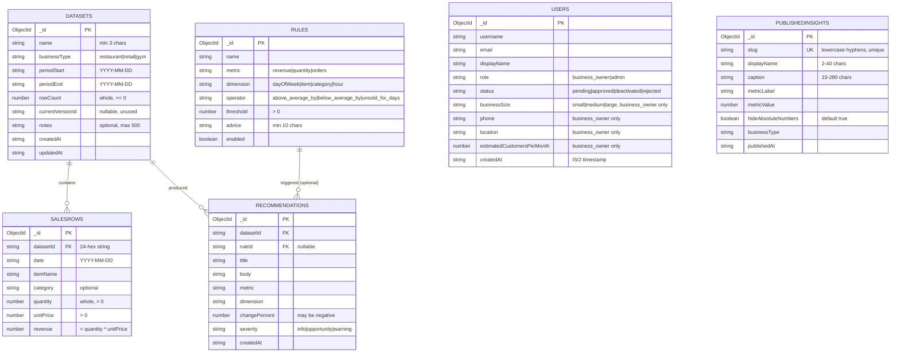

# InsightFlow data model

MongoDB has no schema of its own, so the real contract is `shared/schemas/`. This
document describes what those schemas mean, what links to what, and what is
deliberately missing.

The diagram below is Mermaid. It is text, so an AI assistant can read it, and it
renders as a diagram on GitHub and in most editors.

## How ids work

Every document keeps Mongo's own `_id`, which is an `ObjectId`. The shared schemas
call the same thing `id` and type it as a **24-character hexadecimal string**.

The conversion happens at the edge of the server: a route reads `_id` from the
database and returns `id` as a hex string. Foreign keys such as `datasetId` are
**stored as strings, not ObjectIds**, so a stored document can be handed straight to
a schema without converting anything first.

**Ids are created by the server, never by the browser.** A form that generates its
own id cannot satisfy `idSchema` and will fail silently, because there is no field
on screen for the error to appear in.

## The relationships, in words

- **A data set has many sales rows.** `salesRows.datasetId` points at
  `datasets._id`. This is the only high-volume relationship — one data set holds
  hundreds or thousands of rows. Deleting a data set must delete its rows.
- **A data set has many recommendations.** `recommendations.datasetId` points at
  `datasets._id`. Findings belong to the period they were found in, so deleting a
  data set must delete its recommendations too, or they dangle.
- **A rule may produce many recommendations.** `recommendations.ruleId` points at
  `rules._id` and **is nullable**: a finding that did not come from a saved rule
  stores `null`. Rules are configuration and outlive any single data set, which is
  why `npm run seed` deliberately leaves the `rules` collection alone.
- **Published insights stand alone.** They carry no foreign key at all — see the
  gaps below.
- **Users are not referenced by anything else.** Accounts are real — sign-up
  writes to this collection, and sign-in checks it — but `datasets` and every other
  collection still has no `userId`. Every signed-in business owner currently sees the
  same shared workspace; see gap 3 below.
- **A business-owner account is not usable until an admin approves it.** Sign-up
  always creates `role: 'business_owner'`, `status: 'pending'`. Sign-in refuses
  anything that is not `status: 'approved'`. `server/api/admin/users/[id]/action.post.ts`
  is the only place `status` changes after that, and only an `admin` session can call
  it (`server/utils/auth.ts`'s `requireAdmin`). `admin` accounts have no `businessSize`,
  `phone`, `location` or `estimatedCustomersPerMonth`, are always `status: 'approved'`,
  and are never created through `/api/auth/register` — only `npm run seed` or a direct
  database write creates one.

## Indexes

Created by `server/utils/indexes.ts`, once per process, and safe to run repeatedly.

| Collection | Index | Why |
| --- | --- | --- |
| `salesRows` | `{ datasetId: 1, date: 1 }` | Every analytics query reads one data set in date order |
| `publishedInsights` | `{ slug: 1 }` **unique** | Two businesses must never claim the same public URL |
| `publishedInsights` | `{ publishedAt: -1 }` | The public feed lists newest first |
| `users` | `{ username: 1 }` **unique** | Sign-in and sign-up look a username up in one query and two accounts must never share one |
| `users` | `{ email: 1 }` **unique** | Same reason, for the email half of sign-in |
| `users` | `{ role: 1, status: 1, createdAt: -1 }` | The admin dashboard lists business owners by status, newest pending first |

Uniqueness of `slug` is enforced **here, not in Zod**. Zod validates one value at a
time and cannot know what else exists in the collection.

## Record shapes and form shapes are different

`datasetSchema` describes a row that is already stored: it includes the `id`, the
timestamps and `rowCount`, all of which the server fills in.
`datasetCreateSchema` describes only the five fields an owner types.

**Forms bind to the create schema.** A form bound to the record schema cannot
submit. If the create schema you need does not exist, ask M1 to add it.

## Gaps you should know about

These are real and deliberate, not oversights to route around quietly.

1. **`datasets.currentVersionId` points at nothing.** There is no versions
   collection. The field exists because the contract anticipated data set
   versioning; today it is always `null`. Do not build against it without asking M1.
2. **A published insight cannot be traced back to its source.** There is no
   `recommendationId` or `datasetId` on `publishedInsights`. That means you cannot
   currently answer "which finding did this public page come from", and deleting a
   data set cannot automatically unpublish what came from it — even though the
   delete confirmation promises exactly that. **M4 and M1 need to settle this before
   publishing ships.**
3. **There is no owner on anything.** No `userId` on `datasets` or anywhere else.
   Accounts now exist (`users`, with real sign-up), but every one of them still
   sees the same shared workspace — the product is single-tenant in that sense.
   Adding a second business later means adding an owner reference to almost every
   collection and filtering every query by it.
4. **Nothing enforces referential integrity.** MongoDB will not stop you deleting a
   data set and leaving its sales rows behind. Cascading deletes are the
   application's job, in the route that handles the delete.
5. **`recommendations` has no field for the suggested action.** The scaffolded UI
   shows a plain-language action sentence per finding, and the schema has `title`
   and `body` but nothing for the action. M4 needs this added before wiring.

## Seeded data

`npm run seed` fills `users` with 1 admin and 4 business owners spread across every
status (`approved`, two `pending`, one `deactivated`) so the admin dashboard has
something to show on a fresh database. Only the approved owner (`Bella Pizza`, from
`AUTH_USERNAME`/`AUTH_PASSWORD`) has data: 1 data set, ~630 sales rows across 8 weeks,
and 3 published insights. `recommendations` and `rules` are left empty for M4 to fill.
Ids change on every reseed, so never hardcode one.
